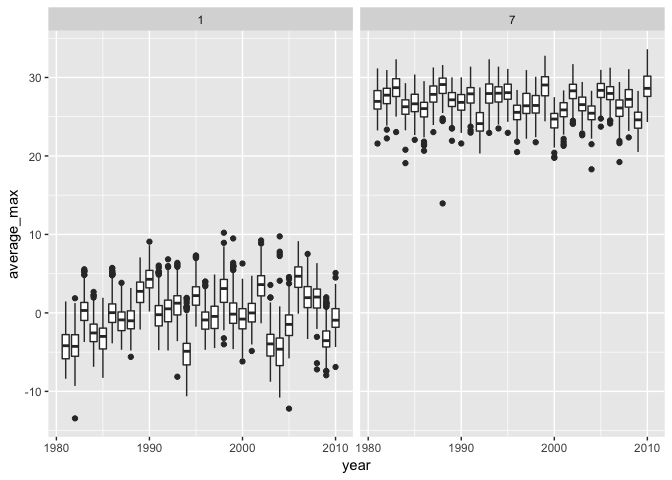

p8105\_hw3\_sc4456
================
Siyan Chen
10/5/2018

Problem 1
=========

data import

``` r
data(brfss_smart2010) 
modified_brfss = 
  brfss_smart2010 %>% 
  janitor::clean_names() %>% 
  filter(topic == "Overall Health") %>% 
  mutate(response =factor(response, levels = c("Excellent", "Very good", "Good", "Fair", "Poor"))) %>% arrange(response)
```

### 1.1

``` r
modified_brfss %>% 
  filter(year == "2002") %>% 
  group_by(locationabbr, locationdesc) %>% 
  summarise(number = n()) %>%
  # find the number of distinct locations within a state
  group_by(locationabbr) %>% 
  summarise(number= n()) %>% 
  # find the number of the same location occruing times
  filter(number == "7") 
```

    ## # A tibble: 3 x 2
    ##   locationabbr number
    ##   <chr>         <int>
    ## 1 CT                7
    ## 2 FL                7
    ## 3 NC                7

In 2002, state CT, FL, NC were observed at 7 locations.

### 1.2

``` r
modified_brfss %>% 
  group_by(year, locationabbr) %>% 
  summarise(number = n()) %>% 
  ggplot(aes(x = year, y = number, color = locationabbr)) + geom_line()+
  theme_bw() + theme(legend.position = "right")
```


Based on the plot, the number of locations for each states varies over years and there is one state presents the dramatic changes.

### 1.3

``` r
modified_brfss %>% 
  filter(locationabbr == "NY") %>% 
  filter(year == "2002" | year == "2006" | year == "2010") %>%
  select(year, locationdesc, response,data_value) %>% 
  filter(response == "Excellent") %>% 
  group_by(year) %>% 
  summarise(mean = mean(data_value), sd = sd(data_value)) %>% 
  knitr::kable()
```

|  year|      mean|        sd|
|-----:|---------:|---------:|
|  2002|  24.04000|  4.486424|
|  2006|  22.53333|  4.000833|
|  2010|  22.70000|  3.567212|

Based on the table, year 2002 has greater mean proportion of excellent response compared to 2006 and 2010, but also has higher standard deviation.

### 1.4

``` r
tidy_response_data =
modified_brfss %>% 
select(year, locationabbr, locationdesc, response, data_value) %>% 
group_by(locationabbr, year, response) %>% 
  summarise(average_proportion = mean(data_value, na.rm = TRUE)) 
  head(tidy_response_data)
```

    ## # A tibble: 6 x 4
    ## # Groups:   locationabbr, year [2]
    ##   locationabbr  year response  average_proportion
    ##   <chr>        <int> <fct>                  <dbl>
    ## 1 AK            2002 Excellent               27.9
    ## 2 AK            2002 Very good               33.7
    ## 3 AK            2002 Good                    23.8
    ## 4 AK            2002 Fair                     8.6
    ## 5 AK            2002 Poor                     5.9
    ## 6 AK            2003 Excellent               24.8

``` r
  ggplot(tidy_response_data, aes(x = year, y = average_proportion, color = locationabbr)) + geom_point() + facet_grid(~response) + labs(y = "Average Proportion %")
```


According to the plot, the proportion of `Very good` response is higher compared to other response and the proportion of `Poor` response is smallest for all states.

Problem 2
=========

``` r
library(p8105.datasets)
instacart = data.frame(instacart) %>%
  janitor::clean_names() 
instacart%>% 
  distinct(aisle_id) %>% 
  nrow()
```

    ## [1] 134

``` r
# getting the number of distinct aisles.
 instacart %>% 
  select(aisle) %>% 
  group_by(aisle) %>% 
  summarise(number = n()) %>% 
  # the number of orders from each aisles 
  mutate(ranking = min_rank(desc(number))) %>% 
  # ranking the the data with total order number from the highest to lowest
  filter(ranking == 1)
```

    ## # A tibble: 1 x 3
    ##   aisle            number ranking
    ##   <chr>             <int>   <int>
    ## 1 fresh vegetables 150609       1

``` r
  # obtaining the aisle which are the most items ordered from.
```

Description: This dataset contains 15 variable and 1384617 observation. The structure is data frame. The key variables include product\_id, product\_name, aisle and others. For exmaple,user\_id 112108 ordered Bulgarian Yogurt at Yogurt aisle which belongs to diary egg department.

### 2.1

There are 134 aisles and the fresh vegetables aisle is the most items ordered from fresh vegetables.

### 2.2 plot

``` r
library(ggplot2)
ordered_instacart = instacart %>% 
  group_by(aisle) %>% 
  summarise(number = n()) %>% 
  as.data.frame() %>% 
  mutate(aisle = reorder(aisle, desc(number))) 
  ggplot(ordered_instacart, aes(x = aisle, y = number)) + geom_point() + theme(axis.text.x = element_text(angle = 90, hjust = 1))
```


Based on the plot, fresh vegetables and packaged vegetables are the most popular items which are ordered more than 100000 times.

### 2.3

``` r
instacart %>% 
  filter(aisle == "baking ingredients" | aisle == "dog food care" | aisle =="packaged vegetables fruits" ) %>% 
  select(aisle, product_name) %>% 
  group_by(aisle, product_name) %>% 
  summarise(number = n()) %>% 
  mutate(ranking = min_rank(desc(number))) %>% 
  # ranking from the most selled items number to the least within each aisle
  filter(ranking == 1) %>% 
# get the most popular prodcut for the interested aisles
  knitr::kable()
```

| aisle                      | product\_name                                 |  number|  ranking|
|:---------------------------|:----------------------------------------------|-------:|--------:|
| baking ingredients         | Light Brown Sugar                             |     499|        1|
| dog food care              | Snack Sticks Chicken & Rice Recipe Dog Treats |      30|        1|
| packaged vegetables fruits | Organic Baby Spinach                          |    9784|        1|

Based on the table, the most popular item of baking ingredients aisle is Light Brown Sugar which was ordered 499 times. The most popular item of dog food care aisle is Snack Sticks Chicken & Rice Recipe Dog Treats which was ordered 30 times.The most popular item of packaged vegetables fruits aisle is Organic Baby Spinach which was ordered 9784 times.

### 2.4

``` r
instacart %>% 
  filter(product_name == "Pink Lady Apples"|product_name == "Coffee Ice Cream") %>% 
  select(product_name, order_hour_of_day, order_dow) %>% 
  # manipulate data
  group_by(product_name, order_dow) %>% 
  summarise(mean_hour = mean(order_hour_of_day)) %>% 
  mutate(order_dow = factor(order_dow, levels = 0:6, labels = c("Sunday", "Monday", "Tuesday", "Wednesday", "Thursday", "Friday", "Saturday"))) %>% 
  spread(key = order_dow, value = mean_hour) %>% 
  knitr::kable()
```

| product\_name    |    Sunday|    Monday|   Tuesday|  Wednesday|  Thursday|    Friday|  Saturday|
|:-----------------|---------:|---------:|---------:|----------:|---------:|---------:|---------:|
| Coffee Ice Cream |  13.77419|  14.31579|  15.38095|   15.31818|  15.21739|  12.26316|  13.83333|
| Pink Lady Apples |  13.44118|  11.36000|  11.70213|   14.25000|  11.55172|  12.78431|  11.93750|

The mean time of odering Coffee Ice Cream and Pink Lady Apples is similar on Sunday and Friday.

Problem 3
=========

``` r
modified_ny_noaa = ny_noaa%>% 
  janitor::clean_names() %>% 
  separate(date, into = c("year", "month", "day"), sep = "-") %>% 
  janitor::clean_names() %>% 
  as.data.frame() %>% 
 mutate(year = as.numeric(year), 
         month = as.numeric(month),
         day = as.numeric(day),
         prcp = as.numeric(prcp),
         snow = as.numeric(snow),
         snwd = as.numeric(snwd),
         tmax = as.numeric(tmax)/10, 
         tmin = as.numeric(tmin)/10)
head(modified_ny_noaa)
```

    ##            id year month day prcp snow snwd tmax tmin
    ## 1 US1NYAB0001 2007    11   1   NA   NA   NA   NA   NA
    ## 2 US1NYAB0001 2007    11   2   NA   NA   NA   NA   NA
    ## 3 US1NYAB0001 2007    11   3   NA   NA   NA   NA   NA
    ## 4 US1NYAB0001 2007    11   4   NA   NA   NA   NA   NA
    ## 5 US1NYAB0001 2007    11   5   NA   NA   NA   NA   NA
    ## 6 US1NYAB0001 2007    11   6   NA   NA   NA   NA   NA

``` r
# Convert the meaningful cell to numerical value. The unit of original data contains tenths of degrees Cº and I convert it to degrees Cº by dividing 10.
```

This data contains 9 variables and 2595176 obervations. The key variables include `id` , `snow`, `tmin`, `tmax` and others. It is data frame structure. There are overall 23356584 NA.

### 3.1

``` r
modified_ny_noaa%>% 
  group_by(snow) %>% 
  summarise(number = n()) %>% 
  arrange(desc(number))
```

    ## # A tibble: 282 x 2
    ##     snow  number
    ##    <dbl>   <int>
    ##  1     0 2008508
    ##  2    NA  381221
    ##  3    25   31022
    ##  4    13   23095
    ##  5    51   18274
    ##  6    76   10173
    ##  7     8    9962
    ##  8     5    9748
    ##  9    38    9197
    ## 10     3    8790
    ## # ... with 272 more rows

``` r
# arrange the number of occuring snowfull value from the greatest to lowest and 0 is the most commonly occured
```

The Most commonly observed snowfall value is 0, because 0 is the most commonly occured value for varible snow.It is not often snow.

### 3.2

``` r
modified_ny_noaa%>% 
  filter(month == 1| month == 7) %>% 
  filter(!is.na(tmax)) %>% 
  group_by(id, month, year) %>% 
  summarise(average_max = mean(tmax)) %>% 
  ggplot(aes(x = year, y = average_max)) + geom_boxplot(aes(group = year)) + facet_grid(~month) 
```



According the the plot, July month generally has much higher temperature compared to January which makes sense. There are outliers which presents the abnormally high temperature at January and abnormally low temperature at July. There are also outliers within stations for each year which suggest the variability of temperature.

### 3.3

``` r
library(patchwork)
tem_plot = modified_ny_noaa%>% 
  filter(!is.na(tmax) , !is.na(tmin)) %>% 
  ggplot(aes(x = tmax, y = tmin)) + geom_hex() 
snow_plot = modified_ny_noaa%>% 
   filter(snow > 0 & snow < 100) %>% 
  ggplot(aes(x = year, y = snow)) + geom_boxplot(aes(group = year)) 
tem_plot + snow_plot
```


Based on the first plot, the combination of tmax and tmin occure at around 0 and 30 degree most often. Based on the second plot, the distribution of snow which greater than 0 and smaller than 100 is similar across years. There are some certain year present the unusuly pattern and outliers.
